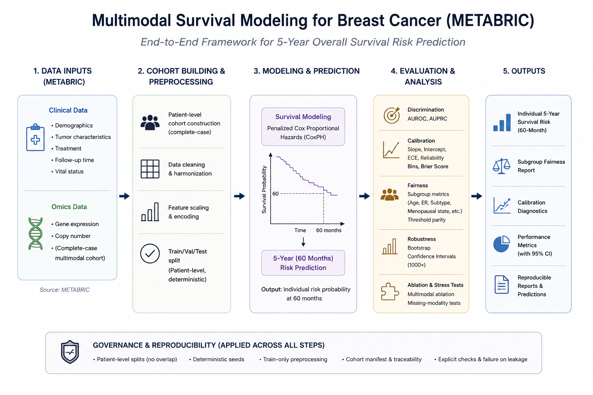

# Multimodal Survival Modeling for Breast Cancer (METABRIC)

Evaluation-driven multimodal framework for survival prediction, calibration analysis, and fairness-aware clinical machine learning using METABRIC clinical and omics data.

This repository explores robust risk prediction under real-world clinical ML constraints, including:

* censoring-aware survival modelling,
* calibration reliability,
* subgroup fairness evaluation,
* robustness analysis,
* and reproducible multimodal experimentation.

  ## Clinical Motivation

Risk prediction systems in oncology often require more than strong discrimination metrics alone. In practical settings, calibration stability, subgroup reliability, and robustness across heterogeneous patient populations can substantially affect downstream clinical interpretation.

This repository explores evaluation-driven multimodal survival modelling with particular attention to calibration behaviour, fairness diagnostics, and reproducible patient-level experimentation.

## System Overview

<p align="center">
  
</p>

The framework integrates:

* clinical variables,
* molecular and omics features,
* calibration-aware prediction,
* subgroup fairness diagnostics,
* and bootstrap robustness analysis

for evaluation-driven survival modelling workflows.

## Core Capabilities

### Survival Modeling

* Penalized Cox proportional hazards models
* Fixed-horizon (5-year) risk prediction
* Censoring-aware survival analysis
* Time-to-event modelling workflows

### Multimodal Learning

* Clinical + omics feature integration
* Missing-modality stress testing
* Multimodal ablation analysis
* Deterministic patient-level cohort construction

### Calibration & Reliability

* Calibration slope and intercept analysis
* Expected calibration error (ECE)
* Reliability bin evaluation
* Bootstrap confidence intervals

### Fairness & Robustness

* Subgroup fairness diagnostics
* Threshold parity analysis
* Robustness benchmarking
* Confidence interval estimation

### Reproducibility

* Deterministic train/validation/test splits
* Cohort manifests and traceability
* Train-only preprocessing workflows
* Fully reproducible evaluation pipelines

## Why This Project

Clinical survival prediction systems require more than discrimination performance alone.

This repository focuses on:

* calibration quality,
* subgroup reliability,
* reproducibility,
* and robustness evaluation

for clinically grounded multimodal survival modeling.

The emphasis is on evaluation-driven machine learning rather than leaderboard optimisation.

## Benchmark Highlights

The reported metrics are dataset-specific and are intended primarily for methodological and evaluation-oriented analysis rather than direct clinical performance claims.

### Recalibrated CoxPH Model

| Metric       | Result      |
| ------------ | ----------- |
| AUROC        | **0.967**   |
| AUROC 95% CI | 0.949–0.981 |
| Brier Score  | **0.064**   |
| Brier 95% CI | 0.047–0.082 |

### Key Observations

* Strong discrimination performance across multimodal risk prediction tasks
* Stable calibration under bootstrap evaluation
* Consistent subgroup discrimination across clinically relevant cohorts
* Moderate calibration heterogeneity in smaller molecular subtypes

## Operational Reliability Considerations

The repository includes several safeguards intended to reduce common reliability issues in clinical machine learning workflows:
- patient-level train/validation/test separation,
- train-only preprocessing,
- deterministic cohort generation,
- calibration-aware evaluation,
- subgroup robustness analysis,
- and bootstrap confidence interval estimation.

These workflows are included to support reproducible and traceable experimentation under realistic clinical ML constraints.

## Research Contributions

* Evaluation-driven multimodal survival modeling
* Calibration-aware clinical ML workflows
* Fairness diagnostics for prognostic modeling
* Bootstrap robustness evaluation
* Missing-modality stress testing
* Reproducible clinical ML pipelines

## Known Limitations

Several limitations remain:
- complete-case cohort selection may introduce sampling bias,
- external cohort validation is not yet included,
- calibration behaviour varies across smaller molecular subgroups,
- and multimodal availability constraints may affect robustness.

Future work will explore cross-cohort validation, advanced multimodal fusion strategies, and calibration-aware foundation modelling approaches.

## Technical Stack

The implementation combines classical survival analysis workflows with modern multimodal machine learning pipelines using PyTorch, XGBoost, Lifelines, SHAP, and reproducible cohort engineering utilities.

### Core Frameworks

Python • PyTorch • Scikit-learn • XGBoost

### Survival & Evaluation

Lifelines • Survival Analysis • Calibration Metrics • Bootstrap Evaluation

### Explainability & Robustness

SHAP • Fairness Diagnostics • Reliability Analysis

### Data Engineering

Pandas • NumPy • Cohort Pipelines

## Repository Structure

```text id="9zht1d"
src/
  data/
  models/
  eval/
  fairness/
  robustness/
  experiments/

scripts/
runs/
tests/
docs/
```

## End-to-End Workflow

### 1. Build Processed Tables

```bash id="w4vjtp"
python scripts/etl_build_processed.py \
  --raw_dir data/raw \
  --out_dir data/processed
```

### 2. Build Multimodal Cohort

```bash id="1w7r9i"
python scripts/build_cohort.py \
  --processed_dir data/processed \
  --out_path data/processed/cohorts/metabric_complete_case_v1.parquet \
  --require_expr \
  --require_cna
```

### 3. Train Survival Model

```bash id="6ub9cq"
python scripts/run_survival_models.py \
  --cohort data/processed/cohorts/metabric_complete_case_v1.parquet \
  --outdir runs/survival/coxph
```

## Calibration Evaluation

The framework supports:

* calibration slope/intercept analysis,
* ECE evaluation,
* reliability bin diagnostics,
* and horizon consistency checks.

## Fairness & Robustness Evaluation

Supported analyses include:

* subgroup AUROC/AUPRC evaluation,
* threshold parity diagnostics,
* bootstrap confidence intervals,
* and calibration comparison across clinical subgroups.

## Reproducibility

The repository emphasises:

* deterministic experimentation,
* patient-level split integrity,
* cohort traceability,
* and evaluation reproducibility.

Key safeguards include:

* stored split manifests,
* train-only preprocessing,
* deterministic seeds,
* and explicit cohort validation.

## Intended Use

Designed for:

* multimodal survival modeling research,
* evaluation-driven clinical ML,
* calibration analysis,
* and fairness-aware prognostic modelling.

Not intended for direct clinical deployment or medical decision-making.

## Detailed Evaluation

Extended calibration analysis, fairness diagnostics, ablations, and robustness evaluation are available in:
[Technical Report](docs/technical_report.md)

## Current Research Directions

* Deep survival learning extensions
* Time-dependent survival evaluation
* Advanced multimodal fusion strategies
* Cross-cohort robustness analysis
* Calibration-aware foundation models for healthcare AI

## Citation

If this repository contributes to your research or technical work, please cite appropriately.

## Author

Toktam Khatibi
Senior Machine Learning Research Scientist

Clinical AI • Multimodal Learning • Survival Modeling • Evaluation-Driven Healthcare AI
