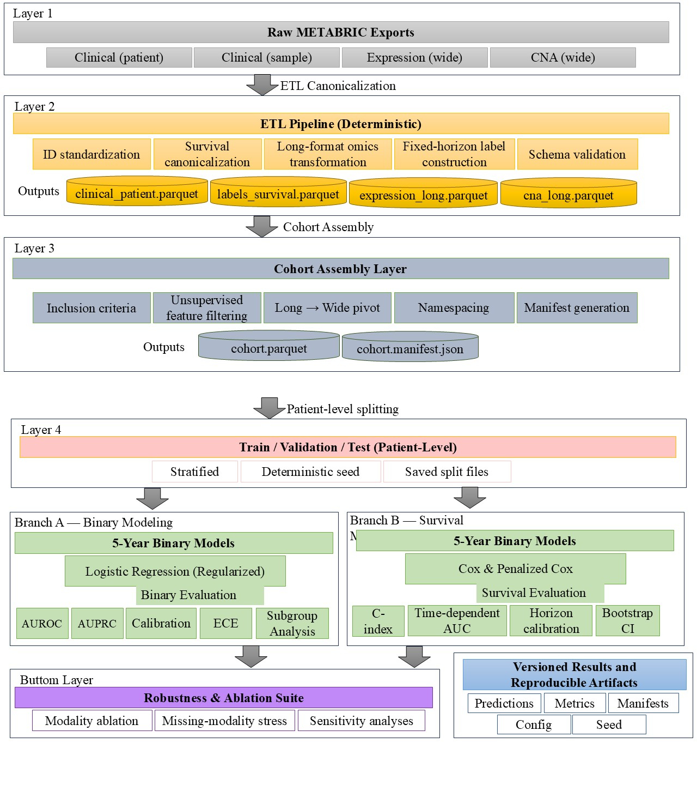

# Multimodal Survival Modeling for Breast Cancer (METABRIC)
**A reproducible, fairness-aware, calibration-conscious framework for 5-year overall survival risk prediction and full survival modeling.**

> **Positioning:** This repository is intentionally designed as a *methodological benchmark framework* (not a one-off model demo).  
> It emphasizes deterministic ETL, explicit data contracts, leakage prevention, reusable pipelines, robust evaluation, and reproducible experimentation.

---

## Contents

- [1. What this project is](#1-what-this-project-is)
- [2. Scientific framing](#2-scientific-framing)
- [3. Data and modalities](#3-data-and-modalities)
- [4. Repository structure](#4-repository-structure)
- [5. End-to-end workflow (recommended)](#5-end-to-end-workflow-recommended)
- [6. ETL pipeline](#6-etl-pipeline)
- [7. Cohort assembly layer](#7-cohort-assembly-layer)
- [8. Splitting protocol](#8-splitting-protocol)
- [9. Modeling](#9-modeling)
- [10. Evaluation framework](#10-evaluation-framework)
- [11. Multimodal ablation + missing-modality robustness](#11-multimodal-ablation--missing-modality-robustness)
- [12. Reproducibility & governance](#12-reproducibility--governance)
- [13. Known limitations](#13-known-limitations)
- [14. Testing](#14-testing)
- [15. Expected raw files](#15-expected-raw-files)
- [16. Outputs and artifacts](#16-outputs-and-artifacts)
- [17. Citation](#17-citation)
- [18. License / acknowledgements](#18-license--acknowledgements)

---

## 1. What this project is

This repository implements a full pipeline for **multimodal breast cancer prognostic modeling** using METABRIC-style data:

- **Primary task:** *5-year Overall Survival (OS) risk prediction*  
- **Also supported:** *full time-to-event survival modeling* (censoring-aware)

The project focuses on *research-grade* criteria:

- **Discrimination** (ranking performance)
- **Calibration** (probability correctness at the population level)
- **Fairness / subgroup stability**
- **Robustness** (especially missing-modality scenarios)
- **Reusable & reproducible pipeline design** (deterministic artifacts, saved splits, manifests)
- **Explicit data contracts** (schema checks, uniqueness checks, strict failure modes)

---

## 2. Scientific framing

### 2.1 Study type and scope
This is a **prognostic modeling** framework (not causal inference, not treatment effect estimation).  
All experiments are designed as **single-cohort internal validation** with strict separation of train/validation/test at the **patient** level.

### 2.2 Targets and modeling objects

Two related (but distinct) targets are supported:

1. **Time-to-event modeling**
   - Survival function: \\( S(t \\mid x) = P(T > t \\mid x) \\)
   - Hazard modeling via Cox-style models and extensions

2. **Fixed-horizon binary prediction**
   - 5-year event probability: \\( P(T \\le 60 \\mid x) \\)
   - Binary classification with censoring-aware label construction

**Key point:** survival models estimate risk over continuous time; binary models estimate risk at a single horizon.

### 2.3 Outcome and censoring rules (fixed-horizon)
For 5-year binary modeling:
- Event by 60 months → positive class
- Survive beyond 60 months → negative class
- **Censored before 60 months** → **undefined binary label** (excluded from binary training/evaluation but retained for survival modeling)

---

## 3. Data and modalities

### 3.1 Modalities treated as “multimodal”
- **Clinical** (structured, low-dimensional)
- **Gene expression** (high-dimensional continuous features)
- **Copy number alteration (CNA)** (high-dimensional continuous or ordinal features)

### 3.2 Long vs wide representation (omics)
Omics are stored in **long format** during processing:
- `(sample_id, feature, value)`

This enables:
- Efficient storage
- Filtering before pivot (critical for memory/compute)
- Clear data contracts

Wide format (one column per feature) is produced only during cohort assembly.

---

## 4. Repository structure

```
data/
  raw/
  processed/
  processed/cohorts/

src/
  data/
    load_clinical.py
    load_expression.py
    load_cna.py
    labeling.py
    assemble_cohort.py
  splits/
    make_splits.py
  models/
    baselines.py
    survival.py
  eval/
    evaluate.py
    survival_eval.py
  experiments/
    ablation.py

scripts/
  etl_build_processed.py
  build_cohort.py
  run_baselines.py
  run_survival_models.py
  run_ablation_suite.py

tests/
  (unit tests for each layer)
```

**Layering principle:**
1) Raw → ETL artifacts  
2) ETL artifacts → Cohort assembly  
3) Cohort → Splits  
4) Splits → Preprocessing + Models  
5) Predictions → Evaluation (discrimination, calibration, fairness, robustness)

## Figure 1. Pipeline Architecture


---

## 5. End-to-end workflow (recommended)

### Step 0 — Create environment (recommended)
Use a clean environment. If you see NumPy/pandas binary-compatibility errors, pin NumPy < 2.

Example (Conda):
```bash
conda create -n metabric_ml python=3.11 -y
conda activate metabric_ml
pip install -r requirements.txt
```

### Step 1 — Build processed artifacts (ETL)
```bash
python scripts/etl_build_processed.py --raw_dir data/raw --out_dir data/processed
```

### Step 2 — Assemble cohort (multimodal complete-case example)
```bash
python scripts/build_cohort.py \
  --processed_dir data/processed \
  --out_path data/processed/cohorts/metabric_complete_case_v1.parquet \
  --require_expr \
  --require_cna
```

### Step 3 — Run baseline binary models (5-year)
```bash
python scripts/run_baselines.py \
  --cohort data/processed/cohorts/metabric_complete_case_v1.parquet \
  --outdir outputs/baselines
```

### Step 4 — Run survival models
```bash
python scripts/run_survival_models.py \
  --cohort data/processed/cohorts/metabric_complete_case_v1.parquet \
  --outdir outputs/survival
```

### Step 5 — Run multimodal ablation suite
```bash
python scripts/run_ablation_suite.py \
  --cohort data/processed/cohorts/metabric_complete_case_v1.parquet \
  --outdir outputs/ablation
```

---

## 6. ETL pipeline

**Goal:** Convert heterogeneous raw exports into canonical, deterministic, analysis-ready artifacts.

ETL responsibilities:
- Identifier cleaning / canonicalization
- Survival variable canonicalization (time, event)
- Sample-to-patient mapping
- Omics transformation into long format
- Fixed-horizon label construction (censoring-aware)
- Strict schema checks (fail fast)

ETL does **not**:
- Fit preprocessors
- Perform supervised feature selection
- Train models

### Outputs (typical)
- `clinical_patient.parquet`
- `clinical_sample.parquet`
- `sample_map.parquet`
- `labels_survival.parquet`
- `labels_5yr.parquet`
- `expression_long.parquet`
- `cna_long.parquet`

---

## 7. Cohort assembly layer

**Goal:** Produce a patient-level modeling matrix with explicit inclusion criteria and a reproducible manifest.

Cohort assembly responsibilities:
- Define inclusion criteria (valid survival labels; modality requirements)
- Merge modalities at the patient level (one row per patient)
- Perform **unsupervised** feature filtering *before* pivot
- Pivot omics from long → wide (namespaced columns)
- Attach survival and fixed-horizon labels
- Write cohort Parquet + manifest JSON (configuration and counts)

### Cohort manifest
Each cohort build writes a manifest documenting:
- Inclusion/exclusion policy
- Modality requirements
- Feature filtering parameters
- Patient counts at each stage
- Horizon definition
- Version identifier / config snapshot

This prevents silent cohort drift and supports exact regeneration.

---

## 8. Splitting protocol

Splitting is:
- **Patient-level**
- **Deterministic** via seed
- **Stratified** (binary label for 5-year task, event indicator for survival)

Rules:
- No patient appears in more than one split
- Preprocessing is fit on training only
- Test set is untouched until final evaluation

Saved splits enable:
- Stable comparisons across experiments
- Reproducible ablation studies

---

## 9. Modeling

### 9.1 Binary baselines (5-year)
Primary baseline family:
- Logistic regression with regularization (L2 / elastic net)

Rationale:
- Interpretable comparator
- Probabilistic outputs (required for calibration analysis)
- Strong linear baseline for structured + omics features

### 9.2 Survival baselines
Primary survival family:
- Cox proportional hazards
- Penalized Cox variants for high-dimensional settings

Survival models:
- Use censoring-aware objectives
- Produce risk scores and survival probability estimates (e.g., at 5 years)

---

## 10. Evaluation framework

Evaluation is designed to be *more than AUROC*.

### 10.1 Discrimination
Binary:
- AUROC
- AUPRC (when imbalance is relevant)

Survival:
- Harrell’s C-index
- (Optional) alternative concordance estimators when censoring is heavy

### 10.2 Calibration
Binary:
- Brier score
- Calibration curve
- Calibration slope/intercept
- Expected calibration error (ECE)

Survival:
- Calibration at fixed horizons via survival probability estimates
- (Optional) integrated measures when supported

### 10.3 Fairness / subgroup stability
Grouped metrics computed by clinically meaningful strata (example):
- Age group
- ER status
- Tumor grade
- Nodal status

Reported as:
- subgroup performance tables
- worst-group performance
- disparity summaries (differences across groups)

### 10.4 Robustness
- Bootstrap confidence intervals (patient-level)
- Missing-modality stress tests
- Modality ablation (clinical-only vs multimodal)
- Sensitivity analyses to key modeling assumptions

---

## 11. Multimodal ablation + missing-modality robustness

This repository treats multimodality as an *experimental variable*, not a static design choice.

Typical configurations:
- Clinical-only
- Expression-only
- CNA-only
- Clinical + Expression
- Clinical + CNA
- Full multimodal (clinical + expression + CNA)

Robustness stress tests include:
- removing one modality at inference time
- random modality masking
- evaluating degradation patterns and stability

---

## 12. Reproducibility & governance

This project enforces research-grade reproducibility:

- Deterministic ETL and cohort assembly
- Versioned cohorts + manifest metadata
- Saved patient-level splits
- Train-only preprocessing fit
- Single-shot test evaluation per configuration (avoid “test-set peeking”)
- Explicit schema checks and failure modes

The design goal is that *any result can be regenerated exactly* from:
- raw files + config + seed

---

## 13. Known limitations

- Single-cohort evaluation (METABRIC only) → external validation is future work
- Retrospective observational cohort → prognostic, not causal
- Expression platform differences (microarray vs RNA-seq) may limit direct transfer
- Complete-case multimodal cohorts can introduce selection bias
- Cox PH assumes proportional hazards; sensitivity analyses recommended
- Clinical utility is not yet decision-analytic (e.g., decision curve analysis)

---

## 14. Testing

Run unit tests:
```bash
pytest -q
```

Testing philosophy:
- Each layer has its own tests (loaders, labels, cohort assembly, splits, evaluation)
- Tests explicitly target common failure modes:
  - ID alignment bugs
  - duplicate patient rows
  - silent schema drift
  - leakage via preprocessing
  - bootstrap instability in single-class resamples

---

## 15. Expected raw files

Place the raw METABRIC exports under `data/raw/`.  
This repository expects (names may be configurable in ETL scripts; align with your raw source):

- Clinical (patient-level)
- Clinical (sample-level)
- Gene expression matrix (often wide)
- CNA matrix (often wide)
- Metadata files if provided by the source export

If your raw file names differ, update the ETL script configuration accordingly.

---

## 16. Outputs and artifacts

Typical outputs include:

- `data/processed/*.parquet` (canonical artifacts)
- `data/processed/cohorts/*.parquet` (cohort matrices)
- `data/processed/cohorts/*.manifest.json` (cohort manifests)
- `outputs/` (model outputs, predictions, evaluation summaries)

---

## 17. Citation

If this repository informs your work, please cite appropriately.  
(You can replace this section with a DOI / Zenodo badge once you archive a release.)

---

## 18. License / acknowledgements

- Dataset: METABRIC (follow dataset licensing/terms of use from the original source)
- Code: choose an open-source license consistent with your goals (e.g., MIT or BSD-3)

---

### Contact / Collaboration
If you are interested in extending this framework (external validation, additional modalities, deep survival models, or clinical decision analysis), feel free to open an issue or propose an extension branch.
